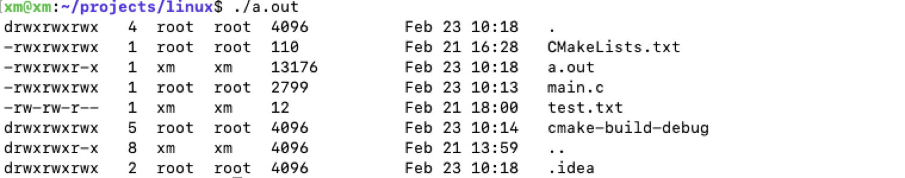
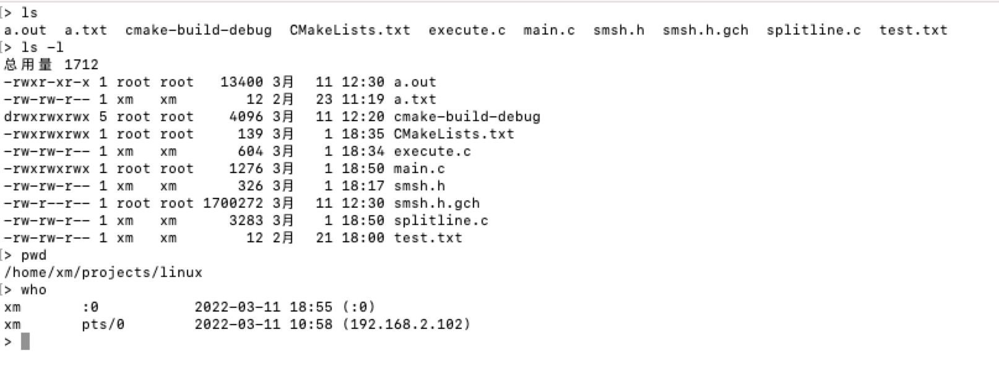

# 带你重写linux基本命令

## 1.运行示例

- ll 命令

- respone

>经常遇到，按在或安装某个软件，要你输入’y' or 'no' 判断情况

- 编写一个自己的shell

## 2. 如何运行

1. 编译命令，例如
    `gcc 01_1_more.c`
2. 运行
    `./a.out`
3. 结果
    

## 3.参考

1. 《unix_linux编程实践教程》
2. manpage

## 4. 笔记（代码大部分放与笔记中）

[p2重写linux命令--用户与文件
](https://justxyx.github.io/posts/p2%E9%87%8D%E5%86%99linux%E5%91%BD%E4%BB%A4-%E7%94%A8%E6%88%B7%E4%B8%8E%E6%96%87%E4%BB%B6/)

[p3重写linux命令--目录与文件属性
](https://justxyx.github.io/posts/p3%E9%87%8D%E5%86%99linux%E5%91%BD%E4%BB%A4-%E7%9B%AE%E5%BD%95%E4%B8%8E%E6%96%87%E4%BB%B6%E5%B1%9E%E6%80%A7/)

[p4重写linux命令--文件系统
](https://justxyx.github.io/posts/p4%E9%87%8D%E5%86%99linux%E5%91%BD%E4%BB%A4-%E6%96%87%E4%BB%B6%E7%B3%BB%E7%BB%9F/)

[p5重写linux命令--链接控制](https://justxyx.github.io/posts/p5%E9%87%8D%E5%86%99linux%E5%91%BD%E4%BB%A4-%E9%93%BE%E6%8E%A5%E6%8E%A7%E5%88%B6/)

[p6重写linux命令-信号与控制](https://justxyx.github.io/posts/p6%E9%87%8D%E5%86%99linux%E5%91%BD%E4%BB%A4-%E4%BF%A1%E5%8F%B7%E4%B8%8E%E6%8E%A7%E5%88%B6/)

[p7重写linux命令-事件驱动编程
](https://justxyx.github.io/posts/p7%E9%87%8D%E5%86%99linux%E5%91%BD%E4%BB%A4-%E4%BA%8B%E4%BB%B6%E9%A9%B1%E5%8A%A8%E7%BC%96%E7%A8%8B/)

[p8重写linux命令-进程与程序
](https://justxyx.github.io/posts/p8%E9%87%8D%E5%86%99linux%E5%91%BD%E4%BB%A4-%E8%BF%9B%E7%A8%8B%E4%B8%8E%E7%A8%8B%E5%BA%8F/)

[p9重写linux命令-可编程的shell](https://justxyx.github.io/posts/p9%E9%87%8D%E5%86%99linux%E5%91%BD%E4%BB%A4-%E5%8F%AF%E7%BC%96%E7%A8%8B%E7%9A%84shell/)

[p10重写linux命令-I/O重定向与管道](https://justxyx.github.io/posts/p10%E9%87%8D%E5%86%99linux%E5%91%BD%E4%BB%A4-I-O%E9%87%8D%E5%AE%9A%E5%90%91%E5%92%8C%E7%AE%A1%E9%81%93/)

[p11 重写linux命令--服务器与socket](https://justxyx.github.io/posts/p11%E9%87%8D%E5%86%99linux%E5%91%BD%E4%BB%A4-%E6%9C%8D%E5%8A%A1%E5%99%A8%E4%B8%8Esocker/)

[p12 重写linux命令-- web服务器](https://justxyx.github.io/posts/p12%E9%87%8D%E5%86%99linux%E5%91%BD%E4%BB%A4-web%E6%9C%8D%E5%8A%A1%E5%99%A8/)

## 头文件

`source.h`
